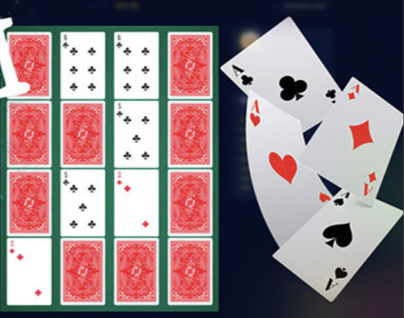

<h1 align="center">Hi there, this is my project</h1>
<h3 align="center">Playing in pairs</h3>

# Development Information

The game was written in TypeScript, using formatters, linters, web packages, plugins, source maps, and build-level optimizations.

**-----------------------------------**

[![package-lock]]  
[![package-json]]

**-----------------------------------**

## Rules

Choose 2 identical maps, make no mistake, and guess all maps.

### Description

In the game, you have to memorize the location of the cards. After a certain period, you need to choose 2 cards of the same kind. If the cards match, they disappear, and if they do not, the game ends. If you guess all the cards, you win! You will also see the time it took for you to guess all the cards.

The game helps train visual perception, memory, and attention. Perseverance and concentration become true friends during the game.
